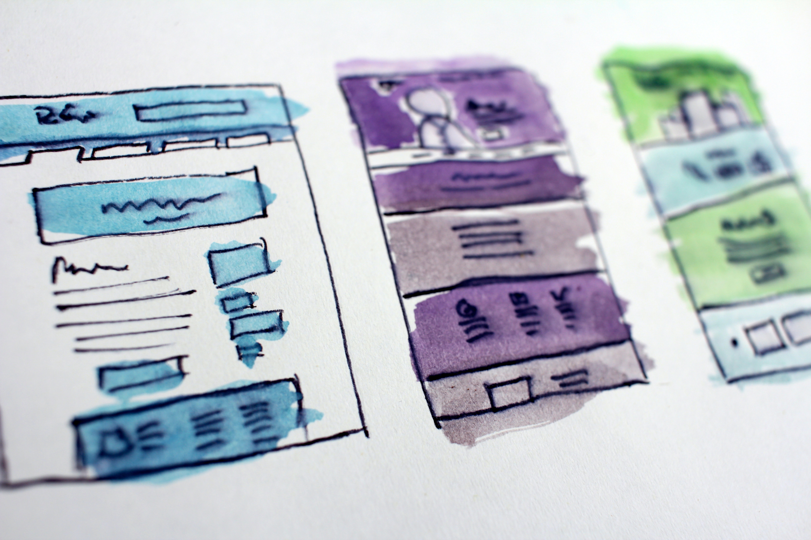

# Visual design

## Data _doesn't_ speak for itself. 

While "the data speaks for itself" is a nice idealistic phrase, in practice people often don't see or hear anything from the data because it is simply presented poorly. While you don't want to present a message the data _isn't_ saying, you do want to ensure valuable insights are both attractive and effective. 

Visual design is about guiding attention. Let's look at some simple tips to guide attention through your data presentation.

## Color

* Choose [**a data color**](../app-settings.md#data-color) that resonates with your story topic or company brand. Bolder, vibrant colors tend to be better for this. 
* Use ****[**section color**](../story-designer/sections.md#section-background-color) backgrounds to define a visual flow for your story. For example, you may want a bold colored introductory section to grab interest, and then use lighter color section backgrounds in the rest of your story that will be less distracting for reading data from charts.  
* Be sure your **text has good contrast** for readability. If a dark background color is chosen on a section or slice, this can make the dark text hard to read. If you add  `--invert` text to the first list of text in your slice, all your text will turn white.
* If you do add photos, think about how well the colors compliment the rest of your visuals. 
* Less is more. The more colors you add, the less you can use color to emphasize specific messages or your data you don't want to get lost.

## Typography & Styles

* There are 4 [**typographic pair styles**](../app-settings.md#typography) ****to choose from. Choose a set that conveys the mood of your story best. Is the story more opinionated or explanatory? Choose the "Literary" style. Is the story more a statistically accurate report update? You may want to choose "Professional", or "Bold" if you want to make a stronger point.
* Use **large text headers** in Slice text to create titles for your sections. You can use [**Markdown style**](../story-designer/slices/#slice-text) text formatting. Try it by starting a text line with one `#` or two `##` to see how it works. 
* Use small text for notes about data or guidance tips you would like to communicate to your viewers. Try it with `#####` or surrounding text like this: `~~Here is a data note~~` . You can also `**bold**` or make text `*italic*` .
* Want to add a bit more😄fun?! While Juicebox doesn't have its own way to insert emojis yet, you can add them yourself [if you know how](https://buffer.com/library/emojis-keyboard-shortcut-mac-windows/#:~:text=How%20to%20add%20emojis%20on%20Windows%3A%20Touch%20keyboard,to%20open%20your%20emoji%20keyboard.). 

## Data ingredient labels & Icons 

* Any data you add to Juicebox will be represented by a [data ingredient](../data-sources/defining-ingredients/). Taking the extra thought to label this well and provide complimentary icons will make the editing experience better for you as an Author. However more importantly, this will result in a more unique and understandable story for your audience. 
* **Keep your labels as short as possible** while maintaining clarity. For example, instead of "Sales Dollars", you may just want to write "Sales" since you can use a dollar sign for your icon and format your numbers with the dollar format. 
* \*\*\*\*[**Ingredient icons**](../data-sources/defining-ingredients/#dimension) allow you to add uniqueness or personality appropriate to your story style and data. Don't be afraid to have some fun with your icons! Search for good icons via text search or categories dropdown.

## Slices & Layouts

* Unlike other dashboard reporting tools, Juicebox is more about helping you present your data like a story that has a beginning, middle, and end. This is why slices lay out vertically, by default, like a cross between a website and a slideshow presentation. You wouldn't start a presentation to your team by showing thumbnails of all your slides at once. Why would a data presentation be any different?
* Put text next to your chart with a slice "Left to Right" or "Right to Left" [**layout option.**](../story-designer/slices/#slice-layouts) This is great for adding more explanatory text that can easily be read while viewing a chart. 
* You also may put entire slices next to each other by changing the [s**ection layout**](../story-designer/sections.md#section-layouts) to "Horizontal". For this option, sometimes slices will scroll horizontally, so this is a good option when there are charts or text you would consider optional viewing. 
* In general, a bit of layout diversity will create a more visually interesting story, but don't forgot to put yourself in your audiences' shoes. They are likely less familiar with the data than you, so you don't want to create unnecessarily distracting layout changes when they are simply wanting to understand something clearly. 

## Branding

* Often you may have a logo or branding colors you would like to style a data story with. You may want to set the [data color](visual-design.md#color) as your logo color. And then use lighter secondary brand colors in section or slice backgrounds. 
* Have a logo? Right now, the best way to present it is [via Markdown](../story-designer/slices/#slice-text) in a slice text area. Add it in your intro section or perhaps also in a concluding section. If your logo shows up too big, change the dimensions of your image file to be the size you would like it to appear as.

## Photos

* You can add images [via Markdown](../story-designer/slices/#slice-text) in slice text. Photos a great opportunity to add visual interest to your story. Similar to a blog post with a great intro image, data stories are no different.  
* Use your own images, or you may want to use a service like [Unsplash](https://unsplash.com/). Don't forget to add attribution where required, perhaps via a note style like `~~Photo credit: (name)~~` 

