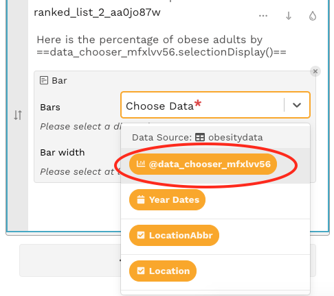

# Data card \[incomplete\]

A data chooser lets the user choose an option from a set of options . The choice will drive the direction of the story below. There are two types:  measure chooser and dimension chooser. Both are accessed by selecting the "Data card" option from the chart drop down, but measures and dimensions cannot be mixed in the same slice.

## Measure chooser

Measure choosers let the user choose a metric to focus on and also display high level metrics, which provides some context for users as they make their selections.

#### To add a measure chooser slice:

* select **Data card** from the chart list
* select the measures you want to add in the order you want them displayed
  * Once you select the first measure, the app will remove the dimensions as options, as you cannot mix dimensions and measures
* \(optional\) add a title

## Dimension chooser

Dimension choosers let the user decide how they want to see their data.

#### To add a dimension chooser slice:

* select **Data card** from the chart list
* select the dimensions you want to add in the order you want them displayed
  * Once you select the first dimension, the app will remove the measures as options, as you cannot mix dimensions and measures
* \(optional\) add a title

## Using dynamic ingredients

Data cards, or more specifically measure and dimension choosers, are particularly powerful when slices further down the app refer to the selections in the choosers.

To reference the selection made in a **Data card:** 

* Create a dimension chooser or measure chooser using the above instructions
* In a slice that is below the chooser that should be referenced, select the data chooser's slice slug in the dimension drop down and/or measure drop down


A slice can reference both a dimension chooser and a measure chooser in the respective dimension and measure drop downs.


