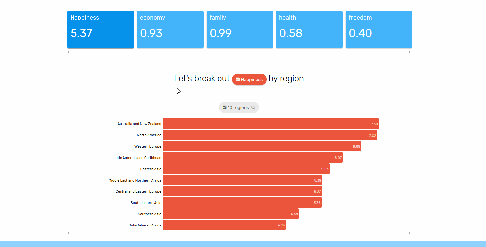

# Data Flow

One of the best and most unqiue aspects of a JBO data story is how we filter and distill your data as the story progresses. There are two ways that we ensure that each data story gives users a connected workflow as they explore your data:

### Visualizations as Filters

Visualizations on cards automatically act as filters for the cards that are positioned after them in the story flow. Therefore, a selection of a bar or bubble will necessarily filter the data further down the page.  
  
In this example, a user selection in the **ranked list** visualization are passed down to the **leaderboard** that follows.

### Capturing User Selections

Certain visualizations \(like the measure chooser and dimension chooser\) can capture user selections you want to use to drive other visualizations.   
  
In this example, a user can select a measure \(like Happiness or Family\) using the **measure chooser**. This selection drives what data the **ranked list** displays to the user. 

